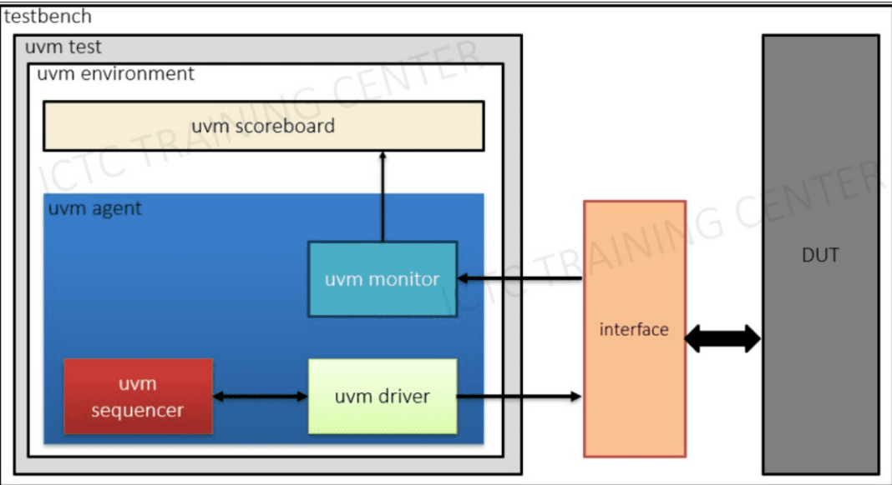

# AXI4-Lite Slave Verification

[]()
[]()
[]()
[]()

A from-scratch UVM verification environment for a 4-register **AXI4-Lite slave** (`myip_v1_0_S00_AXI`, based on the standard Xilinx AXI4-Lite IP template). Built layer by layer — interface, transaction, driver, monitor, scoreboard, tests — as a learning project to understand how a real UVM testbench fits together, not just how to copy one.

## Table of Contents

- [Why this project](#why-this-project)
- [Testbench architecture](#testbench-architecture)
- [File list](#file-list)
- [Testcase list](#testcase-list-tc01tc17)
- [Design limitations this testbench catches](#design-limitations-this-testbench-catches)
- [How to run](#how-to-run)
- [Notes](#notes)

## Why This Project

The DUT looks simple — 4 registers behind an AXI4-Lite interface — but a proper UVM environment around it still has to answer real verification questions: what happens if reset hits mid-transaction? Does the slave actually respect `WSTRB` at the byte level? Can it accept a second write while the first response is still pending? This testbench is built to answer those questions with assertions and a reference-model scoreboard, not just "it ran without crashing."

## Testbench Architecture


**Key design choices:**
- `ARESETN` lives *inside* the interface as a plain variable (not a port), with `assert_reset()` / `deassert_reset()` / `pulse_reset()` tasks — so any test can control reset legally through the virtual interface, without fighting SystemVerilog's net-driving rules.
- Protocol-stability assertions (`VALID` must not drop before `READY`) live in the interface itself, so every single test gets that check for free — no need to repeat it per testcase.
- Timing-sensitive checks that a data-only scoreboard can't see (e.g. "does `AWREADY` stay low while a previous response is still pending?") are written as explicit signal-level checks inside the test, not bolted onto the scoreboard.

## File List

| File | Role |
|---|---|
| `interface.svh` | Interface connecting to the DUT — includes assertions checking that `VALID` doesn't drop before `READY` |
| `axi_seq_item.svh` | Transaction (seq_item): address, data, `WSTRB`, handshake delays |
| `axi_seq_base.svh` | Base sequence, provides `do_write()` / `do_read()` helpers reused by other sequences |
| `axi_seq.svh` | One sequence per testcase |
| `axi_sequencer.svh` | Sequencer (typedef of `uvm_sequencer`) |
| `axi_driver.svh` | Driver — pulls items from the sequencer, drives them into the DUT via the interface |
| `axi_monitor.svh` | Monitor — captures completed transactions, publishes them on an analysis port |
| `axi_agent.svh` | Bundles sequencer + driver + monitor |
| `axi_scoreboard.svh` | Reference model of the 4 registers, checks `RDATA`/`BRESP`/`RRESP` |
| `axi_env.svh` | Bundles agent + scoreboard, sets a `drain_time` for waveform inspection |
| `axi_base_test.svh` | Base test — builds the env, fetches the virtual interface, provides a hang-watchdog |
| `axi_tests.svh` | 17 test classes, one per testcase |
| `package.svh` | Bundles all classes in the correct include order |
| `testbench.sv` | Top module — generates the clock, wires the DUT to the interface, calls `run_test()` |

## Testcase List (TC01–TC17)

| # | Test | What it's really checking |
|---|---|---|
| 01 | `test_reset_basic` | Every slave output goes idle while `ARESETN=0` |
| 02 | `test_reset_mid_transaction` | Reset asserted mid-write doesn't leave `AWREADY`/`WREADY`/`BVALID` stuck high |
| 03 | `test_aw_en_after_reset` | The very first write after reset release is accepted (`aw_en` initialized correctly) |
| 04 | `test_single_write_all_regs` | Basic write to each of the 4 registers |
| 05 | `test_addr_before_data` | `AWVALID` arrives before `WVALID` — DUT still handshakes correctly |
| 06 | `test_data_before_addr` | `WVALID` arrives before `AWVALID` — order shouldn't matter |
| 07 | `test_write_bready_low` | `BVALID` stays high while the master delays `BREADY` |
| 08 | `test_wstrb_single_byte` | Each individual byte lane of `WSTRB` writes correctly, others stay untouched |
| 09 | `test_wstrb_partial_combo` | Non-contiguous `WSTRB` patterns (e.g. `1010`) still write the right bytes |
| 10 | `test_wstrb_all_zero` | `WSTRB=0000` completes the handshake but changes nothing |
| 11 | `test_single_read_all_regs` | Write known values, read every register back, verify match |
| 12 | `test_read_rready_low` | `RVALID`/`RDATA` stay stable while the master delays `RREADY` |
| 13 | `test_write_then_read_same_addr` | Write then immediate read-back of the same address returns the new value |
| 14 | `test_random_write_read` | Randomized write/read mix, fully checked against the reference model |
| 15 | `test_write_overwrite` | Second write to the same register overwrites the first — read confirms the latest value wins |
| 16 | `test_outstanding_txn_block` | A second write is **not** accepted while the first response is still pending (no outstanding-transaction support) |
| 17 | `test_random_stress` | 1000 fully random transactions back-to-back, guarded by a 2ms watchdog |

## Design Limitations This Testbench Catches

Not every "interesting" test is about a bug — some are about documenting real constraints of this DUT so nobody is surprised later:

- **No outstanding transactions.** `aw_en` blocks a second write address until the first write's response has been accepted (`test_outstanding_txn_block`). This DUT is strictly one-transaction-at-a-time.
- **`AWPROT`/`ARPROT` are decorative.** The DUT never reads them for access control — they can be any value without changing behavior.
- **No decode error path.** `BRESP`/`RRESP` are hard-coded `OKAY` — there's no `SLVERR`/`DECERR` logic to verify, so response checks in the scoreboard are really checking "did the DUT stay well-behaved," not address decoding.

## How to Run

```bash
vsim -c work.tb_top +UVM_TESTNAME=<test_name> -do "run -all"
```

Example:
```bash
vsim -c work.tb_top +UVM_TESTNAME=test_single_write_all_regs -do "run -all"
```

Run the full regression:
```bash
for t in test_reset_basic test_reset_mid_transaction test_aw_en_after_reset \
         test_single_write_all_regs test_addr_before_data test_data_before_addr \
         test_write_bready_low test_wstrb_single_byte test_wstrb_partial_combo \
         test_wstrb_all_zero test_single_read_all_regs test_read_rready_low \
         test_write_then_read_same_addr test_random_write_read test_write_overwrite \
         test_outstanding_txn_block test_random_stress; do
    vsim -c work.tb_top +UVM_TESTNAME=$t -do "run -all; quit" | tee log_$t.txt
done
```

Want to see what the driver and monitor are actually doing cycle by cycle? Bump the verbosity (only scoreboard summaries are shown by default):
```bash
vsim -c work.tb_top +UVM_TESTNAME=<test_name> +UVM_VERBOSITY=UVM_HIGH -do "run -all"
```

## Notes

- The original DUT (`myip_v1_0_S00_AXI`) only supports one transaction at a time (no outstanding transaction support) — `test_outstanding_txn_block` verifies this design limitation directly.
- Reset (`ARESETN`) does not live in `tb_top`; it lives inside `axi4lite_if` and is controlled via `vif.assert_reset()` / `vif.deassert_reset()` / `vif.pulse_reset()` — each test calls `pulse_reset()` at the start of its own `run_phase`, so reset happens sequentially as part of the test rather than racing against `run_test()`.
- This project was built and debugged step by step (including chasing down real compile/runtime errors along the way — `vlog-13276`, `vlog-13167`, `vopt-2110`, `SEQREQZMB`) rather than assembled from a finished template, so the structure favors clarity over cleverness.
